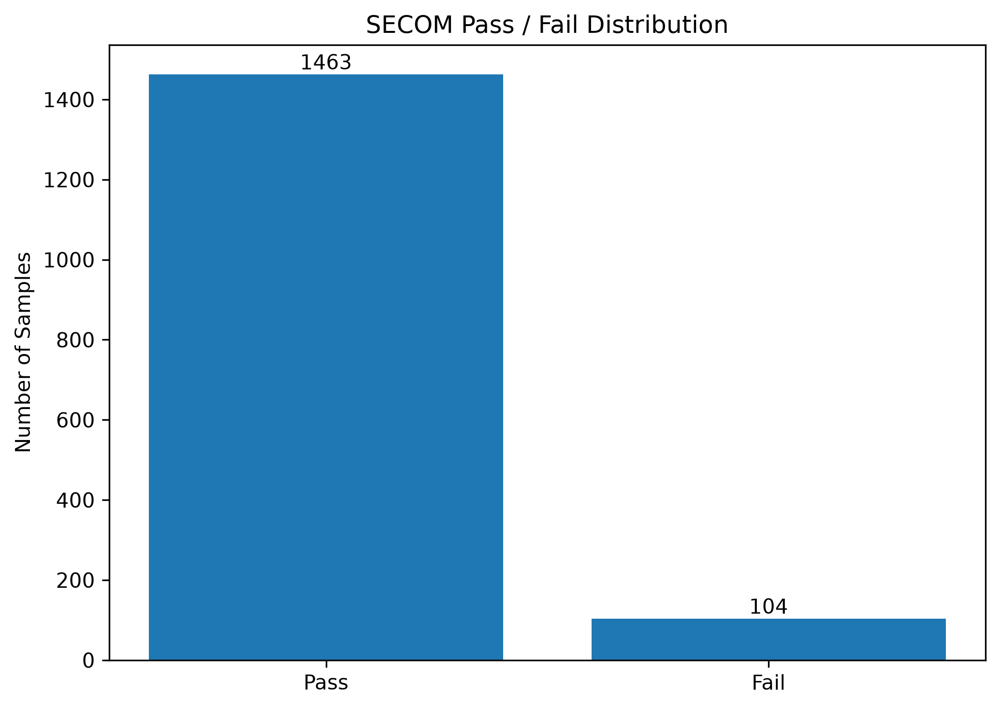

# Semiconductor Yield Prediction with SECOM

> 반도체 제조 공정의 고차원 센서 데이터를 활용하여  
> Pass/Fail 불량을 예측하고, 클래스 불균형·Feature Selection·XGBoost·Decision Threshold Optimization을 단계적으로 비교한 데이터 분석 프로젝트

---

## 1. Project Overview

반도체 제조 공정에서는 수많은 센서와 공정 Parameter가 동시에 수집되며,
이러한 데이터를 활용하여 불량 발생 가능성을 조기에 탐지하는 것이 중요하다.

본 프로젝트에서는 SECOM(Semiconductor Manufacturing) 데이터를 이용하여
반도체 제조 공정의 **Pass / Fail 분류 모델**을 구축하였다.

단순히 Accuracy가 높은 모델을 만드는 것이 아니라,
실제 Fail 샘플을 놓치는 **False Negative를 줄이는 것**을 주요 목표로 설정하였다.

특히 다음 문제를 단계적으로 분석하였다.

- 심각한 Pass / Fail 클래스 불균형
- 다수 센서 Feature의 결측값
- 변화가 없는 비정보 Feature
- 590개의 고차원 Sensor Feature
- 선형 모델의 한계
- 불균형 데이터에서 Decision Threshold 0.5의 한계
- 모델 성능의 데이터 분할 민감성

---

## 2. Dataset

본 프로젝트에서는 SECOM 반도체 제조 데이터를 사용하였다.

### Dataset Summary

| Item | Value |
|---|---:|
| Samples | 1,567 |
| Sensor Features | 590 |
| Total Columns | 592 |
| Pass Samples | 1,463 |
| Fail Samples | 104 |
| Yield Rate | 93.36% |
| Fail Rate | 6.64% |
| Features with Missing Values | 538 |
| Constant Features | 116 |

Target Label:

- `-1` : Pass
- `1` : Fail

모델링 단계에서는 이를 다음과 같이 변환하였다.

- `0` : Pass
- `1` : Fail

### Class Imbalance

전체 1,567개 샘플 중 Fail은 104개로 약 6.64%에 불과하다.

따라서 모든 샘플을 Pass라고 예측하는 모델도 약 93%의 Accuracy를 기록할 수 있다.

이 때문에 본 프로젝트에서는 Accuracy보다 다음 지표를 중요하게 사용하였다.

- Fail Recall
- Precision
- F1-score
- F2-score
- Average Precision (AP)
- ROC-AUC
- False Negative
- False Positive



---

## 3. Project Workflow

프로젝트는 데이터 이해부터 최종 모델 평가까지 총 10개의 Notebook으로 구성하였다.

```text
01. Data Loading
        ↓
02. Exploratory Data Analysis
        ↓
03. Data Preprocessing
        ↓
04. Baseline Modeling
        ↓
05. Class Imbalance / SMOTE
        ↓
06. Feature Selection
        ↓
07. XGBoost Modeling
        ↓
08. Decision Threshold Optimization
        ↓
09. Hyperparameter Tuning
        ↓
10. Final Model Evaluation